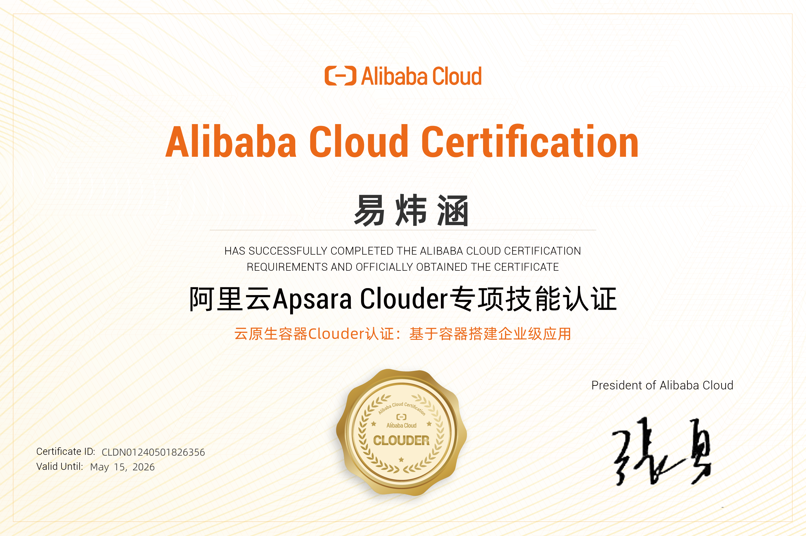
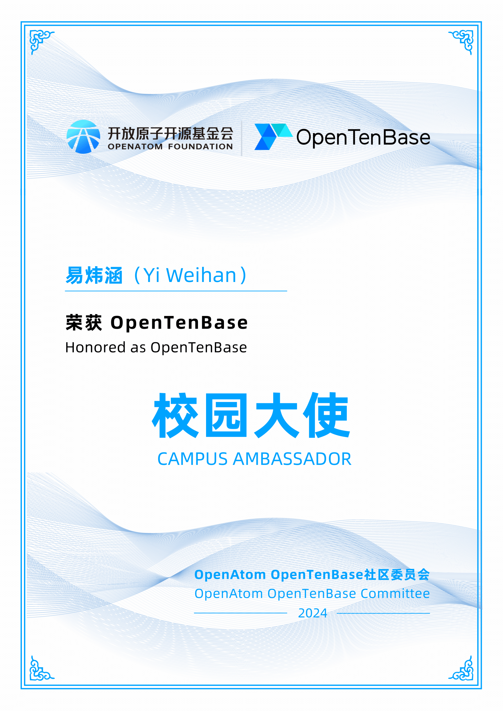

<!-- Header with modern gradient background -->

  
  <!-- Animated header with gradient -->
  
  
  <!-- Profile GIF with modern border -->
  

    
  

  
  <!-- Modern update badge -->
  
  
  <!-- Enhanced profile views -->
    
  
  
  

<!-- Divider with animated typing -->

  

<!-- About section with modern card styling -->

  <table>
    <tr>
      <td>
        
  ### 🎯 About Me
  
  > *That's dope! 🙀 I got visitors on my page! Well, you gotta check me out then 👀*
  
  Currently grinding and hustling ⛽️ as a junior CS student. While I may not have tons of achievements yet 🤫, I'm all about that continuous learning vibe! Following the ancient Chinese wisdom: **"知耻而后勇"** *(Know shame, then be brave)* 💪
  
  🔬 **Research Journey**: Recently joined the [Generic Operational and Optimal Data Lab](https://good.ncu.edu.cn/) - excited to dive deep into cutting-edge research!
  
  🌟 **Open Source Advocate**: Promoting open source culture at Nanchang University, always looking to connect with fellow enthusiasts!
        
      </td>
    </tr>
  </table>

---

## 🏆 MY JOURNEY & ACHIEVEMENTS

  
  <!-- Enhanced GitHub Trophy with modern styling -->
  
  

### 🎖️ Recent Highlights

<table width="100%">
  <tr>
    <td width="50%" valign="top">
      
  **🏅 2024 ASC Competition**
  - 🥈 **Second Class Prize** at [ASC Student Supercomputer Challenge](http://www.asc-events.org/StudentChallenge/index.html)
  - Team achievement in high-performance computing
  
  
      
    </td>
    <td width="50%" valign="top">
      
  **💻 Open Source Hackathon**
  - 🚀 Completed [Food Donation WebApp](https://devpost.com/software/food-donation-webapp) in 24 hours
  - Participated in [ALL IN OPEN SOURCE HACKATHON](https://events.mlh.io/events/11167-all-in-open-source-hackathon)
  
  
      
    </td>
  </tr>
  <tr>
    <td width="50%" valign="top">
      
  **☁️ Cloud Certification**
  - ✅ **Docker Certification** from Alibaba Cloud
  - Completed advanced training camp
  
  
      
    </td>
    <td width="50%" valign="top">
      
  **🌟 Community Leadership**
  - 📢 **Open Source Campus Ambassador** for OpenTenBase
  - Leading open source initiatives at Nanchang University
  
  
      
    </td>
  </tr>
</table>

  <em>Just a rookie grinding hard, but we're getting there! 💪</em>

---

## 👨‍💻 WHO I AM

  <table>
    <tr>
      <td align="center" width="50%">
        
  ### 📍 Personal Info
  
  
  
  🌏 **Location**: Yichun, Jiangxi, China  
  🏫 **University**: Nanchang University  
  🎂 **Born**: 2004  
  💟 **Portfolio**: [MyPage](https://good.ncu.edu.cn/~YiWH/)
        
      </td>
      <td align="center" width="50%">
        
  ### 🎯 WHAT I'M PURSUING
  
  🦿 **Artificial Intelligence**  
  🕸️ **Web Development** *(getting there!)*  
  🦀 **Rust Programming**  
  👨‍💻 **C++ • C • Linux**  
  🧮 **High Performance Computing**  
  📢 **Tech Presentations**  
  ✔️ **LeetCode** *(when I'm not lazy 😅)*
        
      </td>
    </tr>
  </table>

### 🎮 WHAT I LOVE

  
  
  
  
  
  

---  

## 📊 MY CODING STATS

  
  <!-- GitHub Stats Cards with modern layout -->
  <table>
    <tr>
      <td>
        
      </td>
      <td>
        
      </td>
    </tr>
  </table>
  
  <!-- Contribution Streak -->
  
  
  <!-- WakaTime Stats -->
  
  
  <!-- Activity Graph -->
  
  

---
## 🛠️ MY TECH ARSENAL

### 💻 Development Environment

  
  
  
  
  

  <table>
    <tr>
      <td align="center" width="150">
        
         <strong>macOS</strong>
      </td>
      <td align="center" width="150">
        
         <strong>Linux</strong>
      </td>
      <td align="center" width="150">
        
         <strong>VS Code</strong>
      </td>
      <td align="center" width="150">
        
         <strong>IntelliJ</strong>
      </td>
      <td align="center" width="150">
        
         <strong>Windows 11</strong>
      </td>
    </tr>
  </table>

### 🚀 Languages I Rock With

  
  
  
  
  
  
  

  <table>
    <tr>
      <td align="center" width="120">
        
         <strong>Rust</strong>
      </td>
      <td align="center" width="120">
        
         <strong>C</strong>
      </td>
      <td align="center" width="120">
        
         <strong>C++</strong>
      </td>
      <td align="center" width="120">
        
         <strong>Python</strong>
      </td>
      <td align="center" width="120">
        
         <strong>JavaScript</strong>
      </td>
      <td align="center" width="120">
        
         <strong>Java</strong>
      </td>
    </tr>
  </table>

### 🧰 Tools & Technologies

  <table>
    <tr>
      <td valign="top" width="33%">
        
  **🗄️ Databases**
  
  
  
  
        
      </td>
      <td valign="top" width="33%">
        
  **☁️ DevOps & Cloud**
  
  
  
  
        
      </td>
      <td valign="top" width="33%">
        
  **🎨 Design & Others**
  
  
  
  
        
      </td>
    </tr>
  </table>

### 🌱 Currently Exploring

  <table>
    <tr>
      <td align="center" width="150">
        
         <strong>MySQL</strong>
      </td>
      <td align="center" width="150">
        
         <strong>Node.js</strong>
      </td>
      <td align="center" width="150">
        
         <strong>MATLAB</strong>
      </td>
    </tr>
  </table>

---
## 🤝 LET'S CONNECT!

  
  ### 💬 Yo, hit me up through these channels, homie! 
  
  
  
  
  
    
  
  <!-- Social media stats -->
  
  

---
## 🎉 BONUS VIBES

  
  ### 👀 Check out this loopy goodness below! ⬇️
  
  
  
    
  
  <!-- WakaTime coding activity -->
  <!--START_SECTION:waka-->
  <!--END_SECTION:waka-->
  
   
  
  <!-- Footer with modern styling -->
  
  

<!--
**ywh555hhh/ywh555hhh** is a ✨ _special_ ✨ repository because its `README.md` (this file) appears on your GitHub profile.

Here are some ideas to get you started:
All you gotta do is click once, and it'll be able to send me an email

  

💘 this means a arrow into my heaet, that arrow must be something greatly special， Jesus 😼 ！！   
 一颗会转的地球
 
 
- 🔭 I’m currently working on ...
- 🌱 I’m currently learning ...
- 👯 I’m looking to collaborate on ...
- 🤔 I’m looking for help with ...
- 💬 Ask me about ...
- 📫 How to reach me: ...
- 😄 Pronouns: ...
- ⚡ Fun fact: ...
-->
