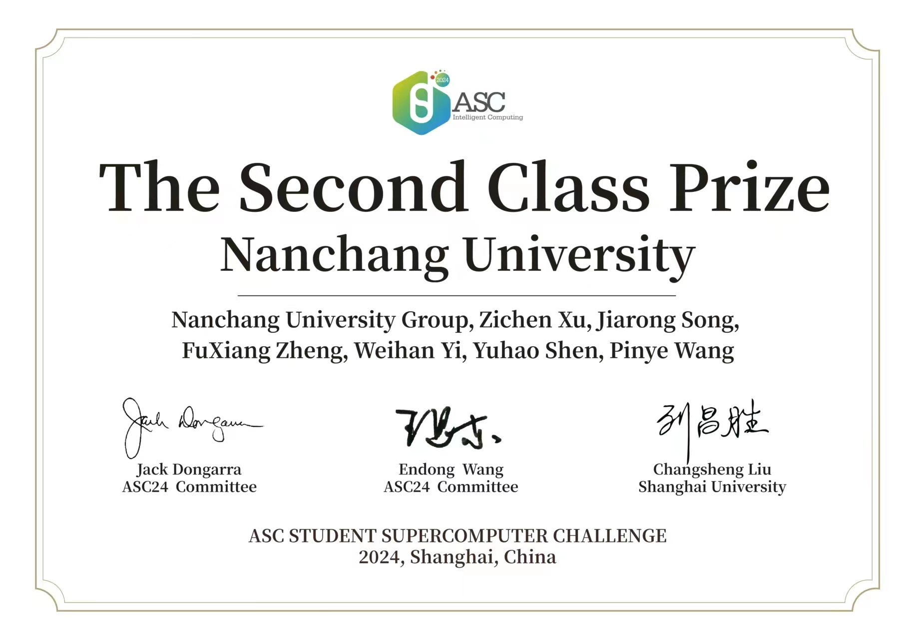

<h6 align="center" style="color: #FF007F;">2024.5.03 update</h6>
<h1 align="center" style="color: #FF007F;">Yo!🤜, I'm teapot1de</h1>
<h3 align="center">A raw Sophomore computer science student from China</h3>

    

That's dope! 🙀 I got visitors on my page! Well, you gotta check me out then 👀. Currently, I may not have any achievements or skills 🤫, but I'm slowly grinding and hustling ⛽️, right? "Know shame, then be brave" is an ancient wisdom of 🀄️ China. I'll keep pushing forward in the field 📁 of computers.Recently,I got the chance to step into [Generic Operational and Optimal Data Lab](https://good.ncu.edu.cn/) to study,hope I can leran a lot and live a better life.

## MY JOURNEY

    
    

I participated in [2024 ASC](http://www.asc-events.org/StudentChallenge/index.html) and our team won the second class prize

I participate in [ALL IN OPEN SOURCE HACKATHON](https://events.mlh.io/events/11167-all-in-open-source-hackathon) and I with my teammates finished [our little project](https://devpost.com/software/food-donation-webapp) in 24 hours

haha that is all, i am a rookie,haha!

## WHO I AM  
😸 A Sophomore computer science student  
📍 Yichun, Jiangxi, China  
🏫 Nanchang University  
🎂 2004   
💟 [MyPage](https://good.ncu.edu.cn/~YiWH/)

## TRY TO  
🦿Artificial Intelligence   
🕸️Web Devlopement (LITTLE)  
👨‍💻 C++  C  Linux  ......  
✔️ LeetCode (lazy haha)    
🧮 Supercomputer（but it's even hard to begin）  

## WHAT I LIKE  
🏀 NBA ⛹ playit 💜Lakers 👑 LBJ 🌹 Drose  
⌨️ LPL 🐦‍🔥 FPX 🐶 lwx  
🦫 loopy  
🎭 Literature and Art  

## MY STATS
    

            https://github.com/dashboard    
                
## MY CS TECHNOLOGY STACK
<!-- 会的东西以及 正在学习的 东西-->

<h3 align="left">My development environment</h3>

 
      
    
    
     
           
          

<h3 align="left">LANGUAGE
:</h3>

 
     
     
     
     
    <a href="https://www.w3schools.com/cpp/" target="_blank" rel="noreferrer"> 
         
    <
    /a>                            

<h3 align="left">Anything else I can useANYTHING ELSE I CAN USE:</h3>

 
     
     

<h3 align="left">Just Getting Started:</h3>

 
     
    
    
    
     
     
     
    
            
          
    <a href="https://www.python.org" target="_blank" rel="noreferrer"> 
         
     
## WAYS TO REACH ME
<!-- 联系方式 -->
<h3 align="left">Yo, you can catch me through these means, homie!!!!!</h3>

## WHAT IS MORE ......

<h3 align="left">Holla at your boy, take a look and see below  
⬇️⬇️⬇️⬇️ 
</h3>
 

<!--START_SECTION:waka-->
<!--END_SECTION:waka-->

<!--
**ywh555hhh/ywh555hhh** is a ✨ _special_ ✨ repository because its `README.md` (this file) appears on your GitHub profile.

Here are some ideas to get you started:
All you gotta do is click once, and it'll be able to send me an email

  

💘 this means a arrow into my heaet, that arrow must be something greatly special， Jesus 😼 ！！   
 一颗会转的地球
 
 
- 🔭 I’m currently working on ...
- 🌱 I’m currently learning ...
- 👯 I’m looking to collaborate on ...
- 🤔 I’m looking for help with ...
- 💬 Ask me about ...
- 📫 How to reach me: ...
- 😄 Pronouns: ...
- ⚡ Fun fact: ...
-->
